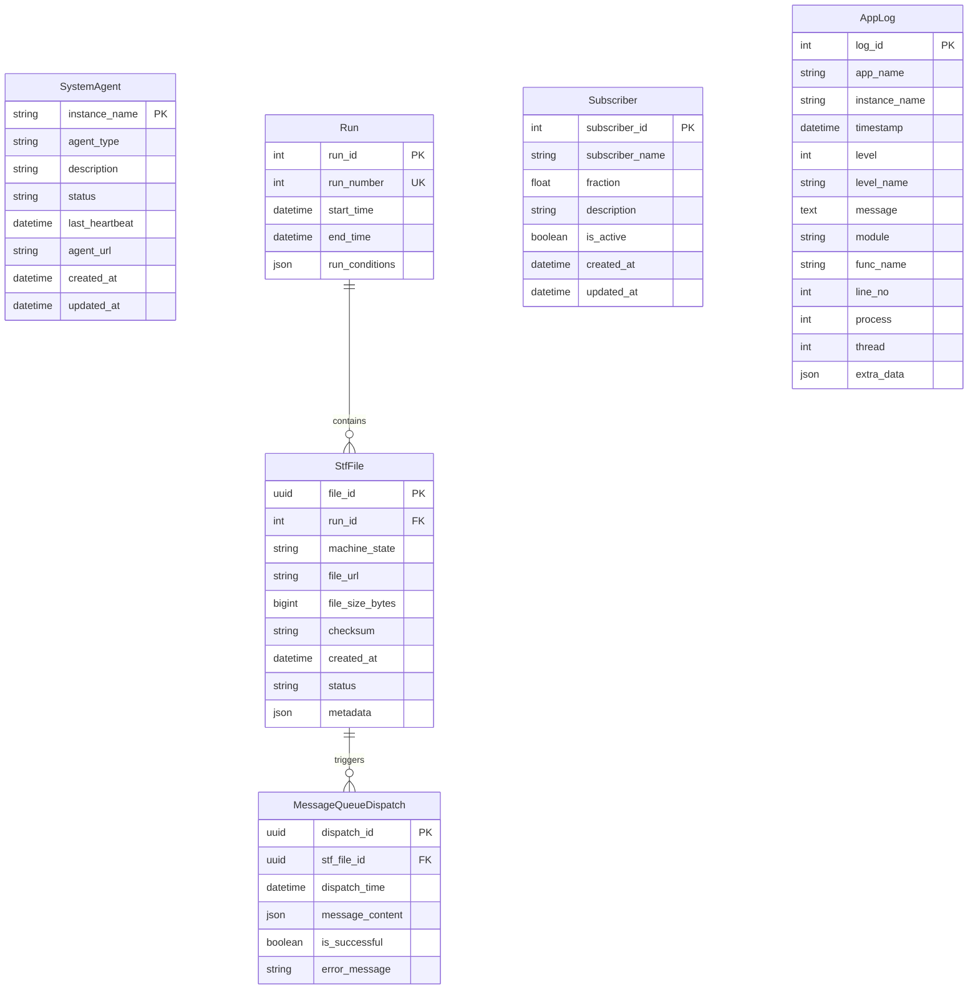

# swf-monitor

**`swf-monitor`** is a monitoring and information service for the ePIC streaming workflow testbed. 

## System Overview

The application is built on a Django-based infrastructure and is composed of two main web apps, a real-time messaging listener, and a PostgreSQL database backend.

### Core Components

1.  **Monitor App (`monitor_app`):** This is the primary user-facing component.
    *   **Browser UI:** A server-side rendered dashboard for viewing agent statuses. It uses standard Django sessions for user authentication.
    *   **REST API:** A programmatic interface for interacting with system agents. It uses token-based authentication and provides an OpenAPI (Swagger) schema generated by `drf-spectacular`.

2.  **MCP App (`mcp_app`):** This app provides the real-time communication layer.
    *   **WebSocket Service:** Built with Django Channels, this service implements the Model Context Protocol (MCP) for real-time, bidirectional communication.

### Model Context Protocol (MCP)

The MCP is a lightweight, JSON-based protocol designed for agents and services to exchange information with the monitor. It is versioned and discoverable.

**Protocol Features:**

* **Versioning:** All messages include an `mcp_version` field. The current version is `1.0`.
* **Request/Response Matching:** Every message has a unique `message_id`. Responses include an `in_reply_to` field matching the `message_id` of the original request.
* **Discovery:** Clients can discover available commands and their descriptions using the `discover_capabilities` command.

**Message Structure:**

```json
{
  "mcp_version": "1.0",
  "message_id": "unique-uuid-here",
  "command": "command_name",
  "payload": {
    "key": "value"
  }
}
```

**Available Commands:**

* **`discover_capabilities`:**
  * **Description:** Returns a list of all available commands and their functions.
  * **Payload (Request):** `{}`
  * **Payload (Response):** A dictionary where keys are command names and values are their descriptions.

* **`get_agent_liveness`:**
  * **Description:** Reports the liveness status (`alive` or `dead`) of all registered agents based on their last heartbeat.
  * **Payload (Request):** `{}`
  * **Payload (Response):** A dictionary mapping agent names to their liveness status.

**Notifications:**

* **`heartbeat`:**
  * **Description:** A notification sent by an agent to signal it is still active. This is not a request and does not receive a direct response.
  * **Payload:** `{ "name": "agent-name", "timestamp": "iso-8601-timestamp" }`

3.  **ActiveMQ Artemis Listener:** An integrated management command (`listen_activemq`) that can connect to an ActiveMQ topic to receive and process agent communications, serving as an alternative ingress for heartbeats.

4.  **PostgreSQL Database:** The primary data store for all agent information, user accounts, and application state.

## Database Schema

The `swf-monitor` uses Django models to define the database schema for tracking system agents, runs, data files, and messaging operations:

<!-- 
Mermaid ERD Syntax Note:
- Fields must follow format: datatype field_name KEY_TYPE
- Correct: "string instance_name PK"
- Incorrect: "instance_name PK" (missing datatype)
- Key types: PK (primary key), FK (foreign key), UK (unique key)
-->



*Figure: Database entity relationship diagram showing the core models and their relationships*

**Key Model Relationships:**
- **Run → StfFile**: One-to-many relationship where each experimental run contains multiple Super Time Frame (STF) files
- **StfFile → MessageQueueDispatch**: One-to-many relationship tracking message queue operations for each STF file
- **SystemAgent, Subscriber, AppLog**: Independent entities for system monitoring and logging

### Testing

A comprehensive test suite is a critical part of this project. It is designed to ensure the reliability, correctness, and stability of all components and is essential for validating changes and preventing regressions.

---

## Getting Started

This guide will walk you through setting up the `swf-monitor` for local development.

### Prerequisites

* Python 3.9+
* PostgreSQL

### Installation and Setup

1.  **Clone the repository:**
    ```bash
    git clone https://github.com/your-username/swf-monitor.git
    cd swf-monitor
    ```

2.  **Create and activate a Python virtual environment:**
    ```bash
    python3 -m venv .venv
    source .venv/bin/activate
    ```

3.  **Install the required packages:**
    ```bash
    pip install -r requirements.txt
    ```

4.  **Configure your environment variables:**
    -   Copy the example environment file:
        ```bash
        cp .env.example .env
        ```
    -   Edit the `.env` file and set your `SECRET_KEY` and `DB_PASSWORD`.
        *You can generate a new `SECRET_KEY` using an online generator or by running `python -c 'from django.core.management.utils import get_random_secret_key; print(get_random_secret_key())'`.*

5.  **Set up the PostgreSQL database:**
    *   Log in to PostgreSQL and create the database and user specified in your `.env` file.
        ```sql
        CREATE DATABASE swfdb;
        CREATE USER admin WITH PASSWORD 'your_db_password';
        ALTER ROLE admin SET client_encoding TO 'utf8';
        ALTER ROLE admin SET default_transaction_isolation TO 'read committed';
        ALTER ROLE admin SET timezone TO 'UTC';
        GRANT ALL PRIVILEGES ON DATABASE swfdb TO admin;
        ```

6.  **Run the database migrations:**
    ```bash
    python manage.py migrate
    ```

### Create an Admin User

To access the admin interface and manage the application, you need to create a superuser account. This user will have `is_staff` set to `True`, granting them access to create, update, and delete agents.

```bash
python manage.py createsuperuser
```

Follow the prompts to set a username, email, and password.

### Running the Application

1. **Start the Django development server:**

    ```bash
    python manage.py runserver
    ```

    The web interface will be available at `http://127.0.0.1:8000/`.

2. **(Optional) Start the ActiveMQ listener:**

    If you are using ActiveMQ for agent heartbeats, open a new terminal and run:

    ```bash
    python manage.py listen_activemq
    ```

### Preparing for Production

When you are ready to deploy the application to a production environment, you should take the following steps to ensure it is secure:

1. **Disable Debug Mode**: In your `.env` file, set `DEBUG=False`. This is a critical security measure.

2. **Configure Allowed Hosts**: In your `.env` file, set `SWF_ALLOWED_HOSTS` to a comma-separated list of the domain names that will serve your application. For example: `SWF_ALLOWED_HOSTS=swf-monitor.example.com,www.swf-monitor.example.com`. This is a critical security setting that prevents HTTP Host header attacks.

## Testing

The project includes a comprehensive test suite to ensure functionality and stability.

### Running the Tests

To run the full test suite, use the Django `test` command:

```bash
python manage.py test
```

All tests should pass.

### Test Coverage

The test suite covers the following key areas of the application:

* **REST API**:
  * Full CRUD (Create, Read, Update, Delete) operations for system agents.
  * Token-based authentication for write operations.
  * Handling of invalid data and non-existent objects.
  * Complete REST API coverage for all models (Run, StfFile, Subscriber, MessageQueueDispatch).
* **REST Logging Integration**:
  * End-to-end testing of agent log submission via REST API.
  * Multiple log level testing (DEBUG, INFO, WARNING, ERROR, CRITICAL).
  * Bulk logging performance testing.
  * Log retrieval and validation.
  * Invalid data handling and error cases.
  * Real-world agent workflow simulation.
* **WebSocket Service**:
  * Authentication checks to ensure only logged-in users can connect.
  * Real-time agent status updates via heartbeats.
  * Graceful handling of invalid messages and database errors.
* **Browser-Based UI**:
  * Authentication flow (login/logout visibility).
  * Form-based CRUD operations for system agents.
  * Access control to ensure only staff users can modify data.
* **Management Commands**:
  * The `get_token` command, including user creation.

## Usage

### Browser Interface

* **Monitor Dashboard**: Access `http://127.0.0.1:8000/` to see the main dashboard.
* **Login**: Click the "Login" link and use the credentials you created.
* **Agent Management**: If you are logged in as a staff user, you will be able to create, edit, and delete system agents from the dashboard.
* **Admin Panel**: If you are logged in as a staff user, click the "Admin" link to access the Django admin site, where you can manage users and permissions.

### API Access and Authentication

For programmatic access, the service provides a REST API that uses token-based authentication for write operations.

1. **Generate a Token**:

    Use the `get_token` management command to generate a token for a user.

    ```bash
    # Get a token for an existing user
    python manage.py get_token <username>

    # Or create a new user and token at the same time
    python manage.py get_token <new_username> --create-user
    ```

2. **Use the Token**:

    Include the token in the `Authorization` header of your API requests.

    ```bash
    # Create a new agent
    curl -X POST -H "Authorization: Token <your_token_here>" \
         -H "Content-Type: application/json" \
         -d '{"instance_name": "new-api-agent", "agent_type": "some_type", "status": "OK"}' \
         http://127.0.0.1:8000/api/systemagents/

    # Update an agent's status using PATCH
    # First, get the ID of the agent you want to update
    curl -X PATCH -H "Authorization: Token <your_token_here>" \
         -H "Content-Type: application/json" \
         -d '{"status": "ERROR"}' \
         http://127.0.0.1:8000/api/systemagents/<agent_id>/
    ```

### API Documentation

The API is documented using OpenAPI (Swagger). You can view the interactive API documentation in your browser:

* **Swagger UI**: `http://127.0.0.1:8000/api/schema/swagger-ui/`
* **ReDoc**: `http://127.0.0.1:8000/api/schema/redoc/`

## Agent Integration

### Logging Integration

Agents can send logs directly to the swf-monitor database using the REST logging module from `swf-common-lib`. This provides centralized log collection and monitoring.

#### Setup for Agents

1. **Install swf-common-lib**:
   ```bash
   pip install swf-common-lib
   ```

2. **Use REST logging in your agent**:
   ```python
   import logging
   from swf_common_lib.rest_logging import setup_rest_logging

   # Setup logging - single function call
   logger = setup_rest_logging(
       app_name='my_agent',
       instance_name='agent_001',
       base_url='http://your-monitor-server:8000'  # Optional
   )

   # Now just use standard Python logging
   logger.info("Agent starting up")
   logger.warning("Processing took longer than expected")
   logger.error("Failed to process item")
   ```

#### Features

- **Zero Configuration**: Works out of the box with default settings
- **Fallback Support**: Automatically falls back to console logging if monitor is unavailable
- **Standard Interface**: Uses Python's standard logging module
- **Configurable**: Supports custom timeouts and monitor URLs

#### REST Logging Endpoint

- **URL**: `/api/v1/logs/`
- **Method**: POST
- **Authentication**: None required (designed for agent logging)
- **Content-Type**: `application/json`

**Example log entry**:
```json
{
    "app_name": "data_agent",
    "instance_name": "agent_001", 
    "timestamp": "2025-01-15T10:30:00.000Z",
    "level": 20,
    "level_name": "INFO",
    "message": "Processing file batch 1/10",
    "module": "data_processor",
    "func_name": "process_batch",
    "line_no": 45,
    "process": 1234,
    "thread": 5678
}
```

All agent logs sent via this endpoint are stored in the `AppLog` model and visible in the monitor dashboard.

---

## Reference

### REST API Endpoints

(Detailed endpoint documentation follows...)

### MCP WebSocket Service

(Details about the WebSocket service... The service currently only handles heartbeat messages.)

### Management Commands

* `createsuperuser`: Create an admin user.
* `get_token <username> [--create-user]`: Generate an API token.
* `listen_activemq`: Listen for heartbeats on an ActiveMQ topic.
* `populate_agents`: Populate the database with initial agent data.

---

## TODO: Agent Workflow Development

### Overview
The swf-monitor serves as the central hub for the ePIC streaming workflow testbed. The system is driven by the `swf-daqsim-agent` which generates Super Time Frame (STF) files and sends workflow messages via ActiveMQ following a state-based schedule (no_beam → beam → run states with various substates).

### Current System Architecture
```
swf-daqsim-agent (scheduler/generator)
    ↓ ActiveMQ messages
[swf-data-agent] → [swf-processing-agent] → [swf-fastmon-agent]
    ↓ status updates
swf-monitor (dashboard/database)
```

### Development Strategy
To avoid interfering with active agent development while establishing the monitoring infrastructure, we will:

1. **Create emulated agents within the monitor repo** as Django management commands
2. **Develop the database schema** to track the complete workflow pipeline
3. **Build monitoring views** to visualize workflow state and debug ActiveMQ traffic
4. **Design the message protocol** so real agents can later plug in seamlessly

### Task List

#### Phase 1: Database Schema Design
- [ ] Analyze STF messages from daqsim to understand data flow structure
- [ ] Design workflow tracking models:
  - STF lifecycle (received, processing, completed, failed)
  - Agent status and heartbeat tracking
  - Message dispatch history and error tracking
- [ ] Extend existing models (StfFile, MessageQueueDispatch) for workflow support
- [ ] Create Django migrations for schema changes

#### Phase 2: Agent Emulation
- [ ] Create `emulate_data_agent` management command:
  - Listen for STF messages from daqsim
  - Simulate data storage/transfer operations
  - Send appropriate status updates to monitor
- [ ] Create `emulate_processing_agent` management command:
  - Listen for processing requests from data agent
  - Simulate data processing workflows
  - Report processing results and status
- [ ] Leverage existing ActiveMQ infrastructure (`activemq_listener.py`, `listen_activemq`)

#### Phase 3: Monitoring Views
- [ ] Create workflow visualization dashboard:
  - Real-time STF processing pipeline status
  - Agent health and performance metrics
  - Historical workflow analysis
- [ ] Implement ActiveMQ traffic monitoring:
  - Message flow debugging interface
  - Error tracking and alerting
  - Performance bottleneck identification

#### Phase 4: Message Protocol Design
- [ ] Define standardized message formats for each agent type
- [ ] Document message flow patterns and error handling
- [ ] Create protocol validation and testing framework
- [ ] Ensure seamless integration path for real agents

### Technical Notes

**ActiveMQ Configuration:**
- Local development: Set `MQ_LOCAL=1` in `~/.env` for no-SSL mode
- Production: Uses SSL with certificate-based authentication
- Default local credentials: admin/admin on localhost:61616

**STF Message Format Example:**
```json
{
    "filename": "swf.20250707.190903.run.physics.stf",
    "start": "20250707190900",
    "end": "20250707190903", 
    "state": "run",
    "substate": "physics",
    "msg_type": "stf_gen",
    "req_id": 1
}
```

**Development Environment:**
- Use swf-testbed virtual environment for all agent emulation
- ActiveMQ and PostgreSQL run via Docker Compose
- Monitor runs on Django development server (port 8001 recommended)

### Success Criteria
- [ ] Complete STF workflow visible in monitor dashboard
- [ ] Emulated agents respond appropriately to daqsim messages
- [ ] Database schema supports full workflow tracking
- [ ] Monitoring views provide actionable insights
- [ ] Real agents can integrate without code changes

