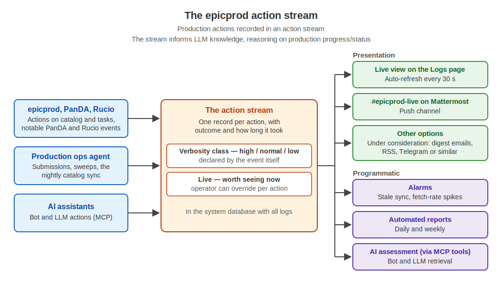

# Action Stream

The action stream is platform machinery: the structured record of what a
system's services do, riding the logging service. epicprod is its first and
principal user — one record per production action — submissions, task operations, sweeps, imports,
configuration edits, assessments — capturing the action, its subject, the
outcome, and the measured duration. It is the raw material for the live view,
for the coming digests and alarms, and for LLM assessment and reporting: the
corpus AI reasons over when it answers "what happened".



Companion docs: [EPICPROD_OPS_AGENT.md](https://github.com/BNLNPPS/swf-epicprod/blob/main/docs/EPICPROD_OPS_AGENT.md) (the agent
whose handlers emit most records), [EPICPROD_OPS.md](https://github.com/BNLNPPS/swf-epicprod/blob/main/docs/EPICPROD_OPS.md) (the
nightly catalog-sync runbook entry). The system-level description lives in the
[ePIC WFMS documentation](https://epic-wfms-docs.readthedocs.io).

## The stream

Records are `AppLog` rows with `app_name='epicprod'` — the action stream is a
namespace within the existing DB-backed swf logging, filterable everywhere
logs are filterable. `instance_name` is the component that performed the
action: `web`, `ops-agent`, `mcp`, `report` (as they come). Log `level`
keeps its universal meaning (INFO/ERROR) and is never repurposed.

Structured fields live in `extra_data`. Reserved keys:

| key | meaning |
|---|---|
| `action` | action identifier, e.g. `task_submit`, `rucio_sweep` |
| `subject_type` / `subject_key` | acted-on object (assessment subject types where applicable) |
| `username` | human or service account driving the action |
| `outcome` | `ok`, `error`, `timeout`, `skipped`, `unrecorded` |
| `reason` | short failure cause, required on every non-ok outcome (last stderr line, `rc=N`, or timeout note); also appended to the message text |
| `duration_ms` | measured execution time — required in spirit for sweeps and timed operations |
| `sublevel` | declared importance (below) |
| `live_default` | declared live-stream recommendation (below) |

Any additional keys are free counts and context (`rows_added=…`,
`jedi_task_id=…`, `summary=…`).

## Publication axes: sublevel and live

Two independent axes govern publication; neither touches log level.

**`sublevel`** — the event's importance, declared at the call site,
AUTHORITATIVE: changing it means changing the event, in code, in git. It says
*which humans* an event reaches (the UI presents it as **Importance**, and
filters on it as an at-or-above **importance threshold**):

- `high` — everyone, including digest and email audiences (submissions,
  sweeps, failures, configuration changes)
- `normal` — live-page watchers (fetches, syncs, assessments)
- `low` — deliberately verbose viewers only (routine mechanics)

**`live`** — a special category: "interesting to some humans, now." Each
event declares a `live_default` recommendation; the effective decision is the
`epicprod_live_policy` override registry in SysConfig — the runtime attention
knob, flipped per action on the [live-policy page](#consuming-the-stream)
without a deploy. The two axes are genuinely independent: a low-sublevel
action can be temporarily fascinating (force it live while you watch), and a
high-sublevel bulk operation can be force-quieted while it floods through.

A **channel** is an importance threshold applied to live events:
`live_stream_q(min_sublevel)` in `monitor_app/epicprod_logging.py` is the one
filter every channel uses. Current and planned channels:

| channel | filter | status |
|---|---|---|
| Logs page live view | live, all sublevels | operating |
| Mattermost `#epicprod-live` | live, `normal`+ | operating (publisher below) |
| Hourly/daily email digest | live, `high` (+ ERROR) | planned |
| RSS | live, `normal`+ | planned |

## Recording actions (developers)

Every state-changing or operationally significant action records exactly one
record per outcome path. The enqueue-vs-execute rule: log at *execution*, with
the requesting username carried in the message; the web tier logs only
enqueue failures.

In-process (web views, services, MCP tools):

```python
from monitor_app.epicprod_logging import log_epicprod_action

log_epicprod_action(
    'web', 'campaign_set_current',
    subject_type='campaign', subject_key=campaign.name,
    username=request.user.username,
    sublevel='high', live_default=True,
)
```

From the ops agent (out of process — REST twin with identical semantics):

```python
t0 = time.monotonic()
...run the doer...
self._log_action('rucio_sweep', t0, outcome='ok',
                 username=str(m.get('created_by') or ''),
                 sublevel='high', live_default=True,
                 datasets_updated=n)
```

Rules of the road:

1. Declare every new action in `ACTION_DEFAULTS`
   (`monitor_app/epicprod_logging.py`) — the greppable catalog the live-policy
   page reads. It MUST mirror the call sites. Every declaration carries a
   plain-English `description` — the one-liner answering "what is this
   action", rendered on the log entry page and the live-policy page so a
   stream reader is never left guessing what an event was.
2. Timed operations pass the start time; every sweep reports its execution
   time to the log.
3. Failed outcomes log at `level=logging.ERROR` and carry `reason` — an
   `outcome: error` with no why is itself a silent failure. The web and MCP
   tiers put the cause in the message text; the agent's `_log_action` takes
   `reason=` and exposes it in both the record and the message.
4. Requester identity travels in the message (`created_by`, `owner`,
   `requested_by`) and is recorded at execution. Anonymous open-face requests
   record an empty username.
5. The logging call never raises; a failed write is logged and the action
   proceeds.

## Consuming the stream

**Operators.** The Logs page (`/logs/`, Logs in the epicprod nav, pre-filtered
`?app_name=epicprod`) is the first live channel: the *Live stream* toggle
(`?live=1`) shows live events with 30-second auto-refresh. Each record's log
entry page embeds the action's catalog description, so what an `evgen_sweep`
or `catalog_sync` *is* reads directly off the record. The
[live-policy page](../src/monitor_app/templates/monitor_app/live_policy.html)
at `/logs/live-policy/` lists every known action with its declared sublevel,
live default, current override, and effective state — overrides editable in
place when signed in, each save itself logged (`live_policy_edit`).

**Mattermost.** The `#epicprod-live` channel is fed by the publisher
(`manage.py publish_epicprod_live`, systemd unit `swf-epicprod-live`) — a
polling tailer that posts one compact message per live event: timestamp,
action, subject, component, outcome, failure reason, duration, and a link
to the log record. Assessment registrations instead use the report title as
a direct link to its dedicated epicprod page, followed only by cadence,
campaign, verdict, and record link; the report body is never copied into the
channel. It posts as the dedicated `epicprod` bot account
(`EPICPROD_LIVE_TOKEN`, falling back to the DISpatcher token until set);
plain channel posts never wake DISpatcher. To follow up on an event, @mention
DISpatcher in a thread under the event post — the post carries everything
the bot needs to pull the full record and drill into the subject. The
publisher re-reads its SysConfig knobs every cycle (`epicprod_live_channel`,
`epicprod_live_min_sublevel`, `epicprod_live_poll_seconds`), so channel
rename, importance threshold, and cadence are UI adjustments, no deploy. A
per-cycle post cap (20) guards against floods; overflow is posted as a
counted summary line, never silently dropped.

**LLMs and bots.** `epicprod_list_actions` is the purpose-built MCP tool —
prefer `summarize=True` (counts by action with ok/error split and duration
statistics) for reporting and assessment; filters on action, instance,
subject, username, outcome, and time window for drill-down. `swf_list_logs
(app_name='epicprod')` returns raw records. Raw listings apply an importance
floor of `normal` by default so routine low-importance mechanics do not
drown the real actions; the excluded records are reported as a count
(`excluded_below_floor`), the floor lifts automatically for
action/subject/outcome drill-downs and summaries, and `min_sublevel` sets it
explicitly. Tool ergonomics are sized for the
smallest consumer (the bot runs a small model): summarize-first, prescriptive
docstrings.

**Alarms and reports (next).** The stream is the data source for the
catalog-sync freshness alarm and the payload-fetch rate alarm, and the
what-happened section of the automated daily/weekly reports. The
born-vs-adopted task ratio (`created_by='association_sweep'` marks adopted
tasks) is the standing migration metric.

## Scheduled automation on the stream

The nightly `catalog_sync` (cron 02:15 → `enqueue-ops-message.py` → ops
agent) chains: csv catalog import → questionnaire import → association sweep
with auto-intake of direct group.EIC submissions → Rucio output snapshot →
EVGEN assimilation → questionnaire automatch (new matches are live
`questionnaire_match_found` events) → questionnaire match cache → progress
refresh. Each step logs
its own record with duration; the chain logs a summary record — the
catalog-freshness timestamp. Measured 2026-07-05: csv 8 s, association sweep
2.3 s (14-day window), Rucio snapshot 36 s, EVGEN 16 s, match 2 s, progress
5 s. Runbook: [EPICPROD_OPS.md](https://github.com/BNLNPPS/swf-epicprod/blob/main/docs/EPICPROD_OPS.md#nightly-catalog-sync).

## SysConfig

`SysConfig` (`swf_sys_config`) is the single-record JSON document of
operator-set configuration — live policy overrides, channel settings
(`epicprod_live_channel`, `epicprod_live_min_sublevel`,
`epicprod_live_poll_seconds`), sweep knobs (`questionnaire_csv_url`) —
viewable and editable at the bottom of the System page. Convention: no
hidden knobs — every key a component reads from SysConfig is present in the
document, at its code default when never overridden, so the System page is
the complete inventory of what is adjustable. The construct
`get_config().get(key, default)` is forbidden: an unset value silently
becoming a hidden code default is a silent failure. Reads go through
`SysConfig.get_setting(key, default)`, which seeds a missing key into the
document (logged as a `sysconfig_edit` action) and returns it; an explicitly
set but unusable value is logged by the reader, never silently replaced. The live policy additionally carries an explicit
`endpoints_update: live` override, although live is that action's default,
as the worked example of an override entry. It is distinct from `PersistentState`, which is
machine-maintained state (counters, run numbers) and not for human editing.
All system configuration lives in the database and is adjustable through the
UI without deploys; SysConfig edits are themselves live actions in the stream.
