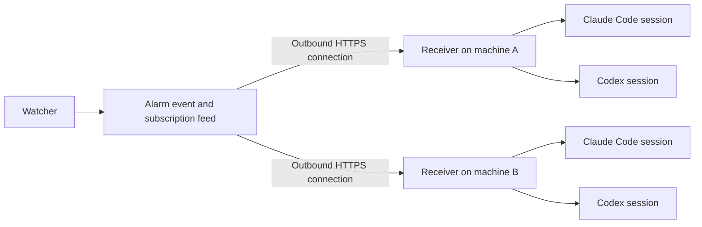

# Alarm delivery to running AI sessions

Status: design; not implemented. Client interfaces reviewed 2026-09-12.

This design specifies an implementation usable by all ePIC operations staff, derived from but independent of the capabilities of Torre Wenaus's TJAI AI assistant system.

## Purpose and scope

Deliver alarm notifications into **all subscribed running Claude Code and Codex sessions**. A watcher detects a problem and publishes a concise message with evidence links. Each matching session receives it without the operator having to discover the problem or type a prompt.

**The system ends at message delivery.** What the AI says next, how it investigates, and what the human authorizes are ordinary interactions in that conversation. This design adds no responder selection, assignment, proposal workflow, approval interception or execution service.

The intended experience is an assistant bringing an issue to the operator's attention and suggesting what to do. The notification supplies the facts that make that conversation possible.

## Operator experience

1. In the alarm system, subscribe to relevant alarm classes, queues or services and choose **Connect my AI**.
2. Install the small client once and connect it to the operator's alarm subscription.
3. Launch Claude Code or Codex through its supported integration. Running sessions register automatically. Setup displays connection health and any restart requirement.
4. When a matching alarm fires, it appears in every subscribed running session, across clients and machines.

An illustrative message:

> **SWF alarm: suspected stalled job**  
> Job 1234567, simulation stage. Recorded SIGABRT followed by observations of no progress. Observation time and evidence freshness: …  
> [Job and diagnostic evidence]

The job number and condition are illustrative. The assistant and operator continue from this message using their existing tools, instructions and permissions.

Subscription controls select topics and allow pause or disconnect. They do not select a primary responding session. Receipt in one session never suppresses delivery to another.

## Architecture

Implement a small distributable client, provisionally **ops-notify**, and a delivery interface in the existing SWF alarm service. The client handles subscription reception and provider-specific session injection. Shared receiver code may run inside a Claude plugin or alongside the Codex launcher; this does not require an additional always-on daemon on every laptop.

The client depends only on the alarm service and the installed AI clients. Provider credentials remain with those clients. No hosted LLM service or separate message broker is needed.

Another alarm system can implement the same feed interface.

## Reuse in SWF

SWF already provides a standalone detector engine, stable condition keys, active/clear tracking, renotification, NoticeSubscription matching and buffered notices. Extend these for AI delivery.

The broader alarm-response lifecycle in [ALARM_QUEUE.md](ALARM_QUEUE.md) is still a design and is not a prerequisite. Existing proposal and production-execution machinery is outside this work.

Two existing details need adaptation:

- The current notice feed is selected by subscriber name and uses a timestamp cursor. Add authenticated subscription ownership and a stable sequence cursor for personal client connections; preserve the existing public-feed contract.
- Existing push plugins are at-most-once. AI delivery should read a durable buffer and reconnect with replay, rather than depend on a successful one-time callback.

Implementation references: [alarm engine](alarms.md) and [notice routing](NOTICE_ROUTING.md).

## Session adapters

**Claude Code.** Prefer an MCP channel plugin. It injects external events through `notifications/claude/channel`. Busy-session notifications queue for the next turn. A successful write does not prove that the model received the event; setup must verify that the channel is enabled. [Channels reference](https://code.claude.com/docs/en/channels-reference)

Channels are a research preview with organization enablement and plugin allowlist requirements. Package the integration for approved installation and report policy or compatibility failures clearly. An ordinary MCP connection alone cannot wake a session. [Channel setup and controls](https://code.claude.com/docs/en/channels)

A Claude peer-socket adapter has also been demonstrated and can be assessed for standalone packaging. Its message format is version-dependent; it must not be used to bypass organization policy.

**Codex.** Connect the normal terminal UI to a private owning app-server. Deliver to each registered live thread with `turn/start` when idle or `turn/steer` with the current `expectedTurnId` when active. Preserve normal settings and permission handling. Do not open a second copy of an active conversation. The official OpenAI documentation describes these interfaces but labels the app-server/WebSocket integration experimental and unsupported for production workloads; pin and verify the supported client versions for the pilot. [App-server documentation](https://learn.chatgpt.com/docs/app-server)

An embedded Codex session whose queue waits for the next human prompt does not meet the proactive-delivery requirement. Report “restart required” and provide the supported launch path.

Initial support covers Claude Code and Codex CLI on Linux/macOS. Desktop and IDE support depends on verified adapters. Delivery never cancels a command or interrupts a deployment to force an alarm through.

## Subscription and broadcast contract

Enrollment uses the alarm service's sign-in and a short-lived pairing code, yielding a revocable feed credential. Authorization governs subscription access; filters govern which events match. The client does not request production-operation credentials.

Register each running session with a stable identity, device, client type, native session identifier and delivery capability. Heartbeats expire dead registrations. Register new sessions automatically and remove exited sessions from live discovery.

For each event, deliver to **every matching live session**. Keep delivery records keyed by event and session. Multiple matching subscriptions must not deliver the same event twice to the same session, but delivery to multiple different sessions is intentional.

New sessions receive a bounded catch-up of currently active matching alarms. Reconnecting sessions resume their own pending deliveries. Ended incidents remain accessible in history and must not be presented as newly raised problems.

## Message and reliability contract

Each message contains:

- schema version, event ID, incident ID and revision;
- source, alarm class, lifecycle state, severity and subject identifiers;
- UTC observation time, evidence freshness and a short factual summary;
- links to the alarm, affected objects and diagnostic evidence.

Use a compact envelope and roughly 2 KB of inline text. Keep connection instructions in setup rather than repeating them with every alarm. Messages remain external event input under the receiving client's existing permissions.

Persist the event and its publication record together. Retry publication with the same event ID. A receiver opens an outbound authenticated HTTPS stream; laptops require no public listening port. Provide replay and bounded REST catch-up using a stable sequence cursor.

Save received messages locally before advancing the receive cursor. Track injection separately for each session. Distinguish received, accepted/queued by client, failed and uncertain. Optional model receipts may confirm receipt; they do not assign work or indicate resolution.

Use durable retry before known acceptance and deduplicate by event/session. An ambiguous injection result requires checking available receipts before redelivery; exactly-once model delivery cannot be assumed. Failed delivery to one session must not block the others.

Reuse suitable async serving infrastructure and verify streaming and replay through the external swf-remote route. A software-only polling fallback can provide compatibility with an explicitly reported additional delay. No LLM calls are used for polling, registration, routing or retries.

## Alarm quality and first pilot

Send raised, materially changed, escalated and cleared events. Repeated identical samples should not flood sessions. This deduplication is per event and session, never a mechanism for selecting one responder.

Begin with a hung-job notification. The detector must distinguish evidence of a stall from stale telemetry or healthy quiet computation. Verify that fatal/progress evidence is available while the job is still running; local watchdog samples or end-of-job reports do not automatically provide that visibility. If only elapsed time is available, label the alarm “suspected stall.”

Detector instrumentation is a producer concern. A recorded event can prove client delivery before a live detector is ready. Existing alarm pages, email and other channels remain available.

Delivery to more sessions can cause more model activity. Make the subscribed session count visible and provide subscription pause; do not silently suppress destinations to reduce usage.

## Build sequence and acceptance

1. Package the independent receiver and client adapters. Demonstrate delivery from a clean installation with only an alarm subscription and supported AI clients.
2. Add scoped subscription enrollment, durable replay and per-session delivery status, reusing SWF routing.
3. Broadcast a synthetic alarm to multiple Claude and Codex sessions on two machines.
4. Connect the hung-job event source and run a small ops-team pilot.
5. Distribute the client with installation, compatibility, revocation and uninstall instructions.

Acceptance checks:

| Check | Required result |
|---|---|
| Independent installation | Direct alarm-to-session delivery using only the documented client package and alarm service |
| Broadcast | Every subscribed running session receives the event |
| Independent receipts | One session's receipt does not suppress another's delivery |
| Idle and busy | No human prompt needed; client scheduling delays reported honestly |
| Reconnect and duplicates | Pending deliveries survive; matching subscriptions do not duplicate a session's copy |
| Session lifecycle | Newly launched sessions register; exited sessions are not reported live |
| Failure isolation | One unavailable client does not block delivery to other sessions |
| Compact presentation | Readable alarm and evidence links without repeated setup boilerplate |

Measure detection latency and event-to-client latency separately. Target event-to-client delivery within five seconds on a healthy connection; client scheduling determines when the model considers it.

Completion is reliable message delivery into all subscribed running sessions. Subsequent human–AI interaction requires no new system layer.

