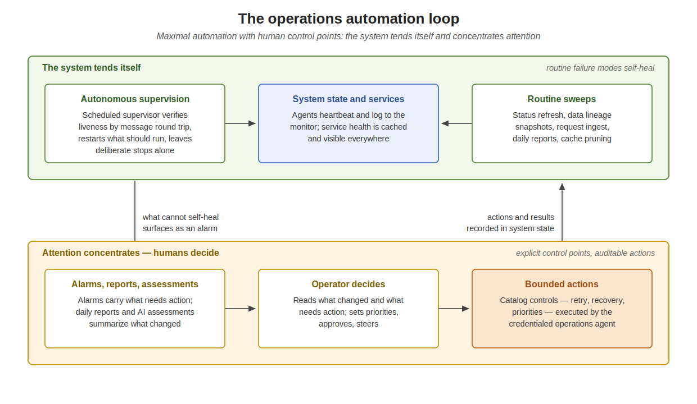

# ePIC Production Operations

This is operations documentation for submitting, monitoring, retrieving logs, etc. for official ePIC production using BNL PanDA on `pandaserver02.sdcc.bnl.gov`. This is the
operations counterpart to the design docs: [PCS.md](PCS.md) (configuration),
[JEDI_INTEGRATION.md](JEDI_INTEGRATION.md) (PCS→JEDI submission design),
[EPICPROD_TASK_CATALOG.md](EPICPROD_TASK_CATALOG.md) (the task catalog),
[EPICPROD_LLM_OPERATIONS.md](EPICPROD_LLM_OPERATIONS.md) (LLM operations), and
[PRODUCTION_DEPLOYMENT.md](PRODUCTION_DEPLOYMENT.md) (deploying swf-monitor).

The `prun` submission path described here is the foundation the automated
PCS submission builds on: it establishes that an operator's identity can submit
official `group.EIC` production tasks. The first official `EIC.production`
submission through this path was validated 2026-06-01 (jediTaskID 36439).

The operations model at a glance — the system tends itself, attention
concentrates, and human decisions act through bounded, recorded controls:



## Identity and client

**EIC/production IAM subgroup.** Official production submission requires
membership in the `EIC/production` subgroup in PanDA IAM
(`panda-iam-doma.cern.ch`). Production managers request to be added. Membership
is carried in the OIDC id_token `groups` claim — it must contain
`EIC/production`. The IAM consent screen names the OAuth client ("panda robot"),
not the subgroup; the subgroup scoping comes from `PANDA_AUTH_VO` plus the
account's group membership, confirmed in the token, not on the consent screen.

**panda-client (`pclient`).** Lives at `~/pclient` on `pandaserver02` — a plain
Python venv. Set up the environment with:

```bash
source ~/pclient/run/setup.sh
```

This sets `PANDA_AUTH=oidc`, default `PANDA_AUTH_VO=EIC`,
`PANDA_CONFIG_ROOT=~/.pathena`, and the server URLs (`pandaserver01:25443`).
`run/setup.sh` is bespoke (the SDCC URLs); `etc/panda/` is generated by the
client install.

**Upgrading the client.** `~/pclient/bin/pip install -U panda-client`. The
upgrade reaches PyPI only with the combined CA bundle in place (see *TLS / CA*).
The previous install is preserved at `~/pclient-2025`.

## Submitting an official production task

The prod-manager recipe, run from a clean working directory containing only the
payload script:

```bash
cd <workdir>                                  # sandbox = this dir; keep it minimal
source ~/pclient/run/setup.sh
export PANDA_AUTH_VO=EIC.production
rm -rf "$PANDA_CONFIG_ROOT/.token"            # force a fresh subgroup-scoped token
prun --exec "./my_script.sh" --official \
     --outDS group.EIC.$(uuidgen) \
     --nJobs 1 --expertOnly_skipScout \
     --vo wlcg --site BNL_PanDA_1 \
     --prodSourceLabel test \
     --workingGroup EIC.production \
     --noBuild --outputs myout.txt
```

`--official` with the `group.EIC` output scope is what exercises the
`EIC.production` privilege; an authorization rejection means the identity is not
in the subgroup. `--prodSourceLabel test` makes this a test-label task carrying
the production identity — the right shape for a capability check.
`--expertOnly_skipScout` is valid but hidden from `prun --help`.

**Authentication is interactive and must run in a real shell.** Deleting the
token forces a fresh OIDC device flow: `prun` prints a verification URL, then
prompts `Ready to get ID token? [y/n]`. It cannot be backgrounded or driven by a
non-interactive process (it reads the prompt from stdin and will hit EOF).
Open the URL, authenticate, consent as `EIC.production`, answer `y`. The token
is then cached under `$PANDA_CONFIG_ROOT` and reused by subsequent commands.

**Result.** `prun` prints `jediTaskID=<N>`. Note that PanDA records the task's
`workinggroup` as `EIC` even though `--workingGroup EIC.production` was passed —
the production dimension is the IAM role, not the working-group field.

## Campaign-task PanDA operations

PCS records PanDA/JEDI task associations in `PandaTasks`, one row per physical
submission attempt. `ProdTask.panda_task_id` is only the current/preferred
pointer used by the existing UI. The first attempt uses the logical PCS composed
task name as the PanDA `taskName`/`outDS`; later attempts use the same name with
`.tryN` appended (`.try2`, `.try3`, …), so every retry or site race has a unique
PanDA task name and Rucio output namespace.

`.tryN` is the production feature that makes whole-task rerun and future site
racing safe: it preserves one logical campaign task identity while giving each
physical PanDA submission its own concrete task and output names.

The campaign task compose page shows the associated PanDA tasks in a `PanDA
Tasks` table. When a campaign task has an associated JEDI task, the page exposes
three operations:

| Operation | When used | Effect |
|---|---|---|
| **Add Another Retry** | The PanDA task is still active and failures have exhausted the current attempt limit. | Queues `panda_api.increase_attempt_nr(jediTaskID, 1)` through the prod-ops agent. This increases the allowed attempts on the existing task; the UI shows the current job-level `nmax` when PanDA exposes it. |
| **Restart And Retry Failures** | The PanDA task is finished or otherwise retryable in PanDA, and only failed work should be retried. | Queues `panda_api.retry_task(jediTaskID, new_parameters={})` through the prod-ops agent. PanDA retries failed work within the existing task. |
| **Rerun Entire Task** | The full task should be submitted again as a new concrete production attempt. | Allocates the next `PandaTasks` row, appends `.tryN` to the physical PanDA task and output names, and submits a new task. This reruns all work. |

The first two operations are native PanDA operations on an existing JEDI task.
They do not create a new Rucio output namespace. The third operation is a new PCS
submission attempt and therefore creates a new physical PanDA task name and Rucio
namespace. Recorded submission fields are production provenance and are not
cleared by operator actions.

PanDA tasks submitted outside PCS can still be associated: when a PanDA task page
is opened, swf-monitor first looks in `PandaTasks`, then performs an exact
PanDA-task-name match against PCS task identities. If exactly one PCS task
matches, it records the association dynamically. Ambiguous or missing matches are
left unlinked; no fuzzy match changes task state.

## TLS / CA — pip and Rucio from this host

BNL internal services (`*.sdcc.bnl.gov`: PanDA, swf-monitor, Rucio) use a
private CA captured in `swf-monitor/full-chain.pem`. `~/.env` points
`REQUESTS_CA_BUNDLE` there so `requests`-based tools trust those servers. That
bundle lacks public roots, so on its own it makes `pip`/`requests` reject
PyPI's valid public certificate (`CERTIFICATE_VERIFY_FAILED`), and it overrides
even an explicit `--cert`.

Resolved by a combined bundle = system public roots + the BNL chain, at
`/data/wenauseic/certs/ca-bundle-combined.pem`, with `REQUESTS_CA_BUNDLE` and
`SSL_CERT_FILE` pointing at it (set in `~/.env`, auto-rebuilt when either source
changes). Both PyPI and `*.sdcc.bnl.gov` then validate against one trust store.

## Monitoring

ePIC-tailored task and job views in swf-monitor:

| | Path |
|---|---|
| Task | `panda/tasks/<jeditaskid>/` |
| Job  | `panda/jobs/<pandaid>/` |
| System status | `panda/system/` |

- Internal (BNL CILogon): `https://pandaserver02.sdcc.bnl.gov/swf-monitor/<path>`
- External (swf-remote proxy, django login): `https://epic-devcloud.org/prod/<path>`
- Generic BigPanDA: `https://pandamon01.sdcc.bnl.gov/task/<jeditaskid>/`

System status is documented in [SYSTEM_STATUS.md](SYSTEM_STATUS.md). The page
and its JSON endpoint read cached DB rows refreshed by `epicprod_ops_agent`;
they do not probe services from Apache requests. The production nav `System`
item turns red when the cached aggregate is red or stale, so both
`pandaserver02` and devcloud surface infrastructure trouble quickly.

## AI assessments

epicprod stores append-only AI assessments of production objects. The current
supported subjects are campaign tasks, PanDA tasks, PanDA jobs, and PanDA
sites/queues. Assessments appear on the corresponding object pages and in the
production nav under **AI**, which lists all assessment content with counts by
subject type.

The architecture for corun-ai-backed LLM operations and artifacts is documented in
[EPICPROD_LLM_OPERATIONS.md](EPICPROD_LLM_OPERATIONS.md). This section records
the operational details of the current AI assessment path.

The primary persistent record is now a corun-ai Page in section
`epicprod.assessment`. `epic_register_ai_assessment` writes the Markdown
assessment text as corun-ai Page content and stores subject metadata in
`Page.data`, including `artifact_type: "ai_assessment"`,
`source_system: "swf-monitor"`, `ui_visible: false`, subject type/key/label/url,
username, and AI/model identifier. `ui_visible: false` hides these service-owned
artifacts from corun-ai/codoc browse UI; it is not an access-control boundary, and
the Pages remain available through the corun-ai REST API and direct URLs. The
subject object's own JSON field stores only
`corun_page_group_ids`, so object pages can show their assessments without
embedding the assessment text in task, job, or queue records. Assessment entries
are append-only; corrections and followups are represented as additional corun-ai
Pages.

Older local `AIContent` rows remain readable. They store the assessed subject as
a string type/key pair, display label, monitor URL, human or service username,
AI/model identifier, Markdown assessment text, optional JSON metadata, and
creation time. The old subject JSON pointer is `ai_content_ids`.

The legacy `AIContent` mechanism is temporary during migration only. After the
corun-ai-backed path is validated and the backfill is complete, new writes should
remain corun-ai-only and the old local mechanism should be removed or thoroughly
disabled so operators and AI clients have one assessment system to reason
about.

Backfill existing local rows after deploying corun-ai credentials:

```bash
# inspect
python src/manage.py backfill_ai_content_to_corun --dry-run

# backfill all legacy AIContent rows into corun-ai and link subject pointers
python src/manage.py backfill_ai_content_to_corun
```

The command is idempotent. It records the created Page group id in
`AIContent.data.corun_page_group_id`, preserves legacy quality/comment metadata
inside the corun-ai Page data, sets `ui_visible: false`, and appends the Page group
id to the subject JSON field when the local subject can be resolved. It does not
delete legacy rows.

Review metadata uses `quality` and `comment` fields when present. The valid
non-empty quality values are `wrong`, `poor`, and `good`; an empty quality
string means no quality review has been recorded. AI content retrieval returns
quality and comment as top-level fields and inside structured `data` when
present.

The canonical subject types for new assessments are:

| Subject type | Key |
|---|---|
| `campaign_task` | PCS composed campaign task name |
| `panda_task` | JEDI task id, or PanDA task name when no JEDI id is known |
| `panda_job` | PanDA job id (`pandaid`) |
| `panda_queue` | PanDA queue name; if the queue name equals the site name, the row represents the site as a whole |

AI clients register assessments through MCP with
`epic_register_ai_assessment`. The tool resolves known subjects, creates the
corun-ai Page, and appends the new Page group id to the subject JSON field. This is
the write path intended for Codex, the PanDA Mattermost bot, and automated
production assessors. The public subject type names above are the MCP interface;
implementation-specific model names are not part of that interface. MCP
registrations stamp metadata with
`registered_via: "mcp"` and `mcp_tool: "epic_register_ai_assessment"`.
When the Mattermost bot registers an assessment, its harness stamps
`username: "bot"`, `ai` as the exact model used, and `data.origin` with
`type: "bot"` plus the same model.

MCP detail tools that can return assessed subjects include an `ai_content`
retrieval block. When `ai_content.available` is true, clients should call the
tool and arguments supplied in that block, for example
`epic_get_ai_content(corun_page_group_ids=["..."])`. Legacy detail payloads may
also include `ids` for local `AIContent` rows. Clients should use the supplied
arguments directly instead of reconstructing a subject type/key lookup from the
parent object.

Assessment text is rendered as Markdown in the UI and sanitized before display.
The metadata row identifies who registered it, which AI/model produced it, and
when it was created.

## Logs

Two distinct artifacts:

**Pilot (framework) log** — the HTCondor job stdout/stderr/batch from the
harvester, served on the job page as `log_urls`. `study_job`
(`src/monitor_app/panda/queries.py`) derives these by joining the job to its
harvester worker (`harvester_workers.stdout/stderr/batchlog`), falling back to
splitting the `pilotid` field. The pilot dumps the payload stdout *inline* near
the end of its stdout, so for small payloads the script output is visible there.

**Payload log (complete)** — the job's Rucio log tarball,
`<taskname>.log.<jeditaskid>.<seq>.log.tgz` in the `.log` dataset, replicated on
`BNL_PROD_DISK_1`. It contains `payload.stdout`, `payload.stderr`,
`pilotlog.txt`, `pandatracerlog.txt`, `PoolFileCatalog.xml`, and the pilot
heartbeat/upload JSON.

Retrieving the tarball by hand:

```bash
# 1. resolve a replica (Rucio REST, x509, account panda, VO eic — the
#    rucio-eic-mcp-server pattern). The advertised replica is xrootd-only:
#    root://dcintdoor.sdcc.bnl.gov:1094/pnfs/sdcc.bnl.gov/eic/epic/disk/group/EIC/...
# 2. fetch with the long-lived proxy and extract:
export X509_USER_PROXY=/data/wenauseic/longproxy-for-rucio
xrdcp -f "root://dcintdoor.sdcc.bnl.gov:1094/<pfn>" "$SWF_TMP_DIR/downloads/<lfn>"
tar -xzf "$SWF_TMP_DIR/downloads/<lfn>" -C <dest>
```

The Rucio metadata path (resolve/list) is what the bots and the rucio MCP do
routinely; fetching the *bytes* over xrootd is the added step, and it needs the
proxy. `BNL_PROD_DISK_1` advertises only a `root://` door, so `xrdcp` (or
`xrdfs`) is required — a plain https GET does not apply.

**Fallback — the BigPanDA filebrowser.** If the direct Rucio path is ever
unavailable, the generic BigPanDA monitor exposes the same payload logs through
its filebrowser, which does the Rucio download server-side and serves the files
over HTTP without OIDC:

```bash
curl -sk -H 'Accept: application/json' \
     "https://pandamon01.sdcc.bnl.gov/filebrowser/?pandaid=<pandaid>"
```

returns a JSON file list with media links to download (the approach in Xin
Zhao's `get_job_logs.sh`). Plan B only: it couples to the generic monitor and
its datastore, the server-side fetch is synchronous (seconds), and it does not
generalize to the other credentialed operations the ops agent exists for —
hence the direct Rucio path above is preferred.

## Scratch / cache area

`/data/swf-tmp` (`$SWF_TMP_DIR`) is the managed, evictable scratch root on the
large `/data` volume — `/tmp` is tiny and on the squeezed root volume, so it is
not used for testbed scratch. Layout:

```
/data/swf-tmp/
  panda-logs/<jeditaskid>/<pandaid>/   # extracted job log members
  downloads/                           # transient tarballs
  django-cache/                        # fallback Django file cache if DJANGO_CACHE_DIR is unset
```

Owned `wenauseic:eic`, setgid, world-readable so a web view can serve cached
output without holding any credential. Contents are reclaimable (logs are
immutable and re-fetchable from Rucio) and pruned periodically.

## Payload-log retrieval

A complete, clean payload log is one click from the job page, served from the
`$SWF_TMP_DIR/panda-logs/<jeditaskid>/<pandaid>/` cache. Three pieces:

- **Doer** — `scripts/cache-payload-log.py`: resolves the log DID's replica
  (Rucio REST, x509, account `panda`), `xrdcp`s the tarball (bounded by
  `XRDCP_TIMEOUT`), extracts the members into the cache, and writes a `.done`
  sentinel last. Hit and skip are keyed on `.done`, never on a single member — a
  log may legitimately lack `payload.stdout`. Usable standalone, by cron, or by
  the agent.
- **Agent** — `agents/epicprod_ops_agent.py`: an always-on `BaseAgent`
  (`agent_type=PRODOPS`) on the anycast queue `/queue/epicprod.ops`. It runs as
  `wenauseic`, so it alone holds the Rucio proxy and runs xrootd, under a fixed
  `prodops` namespace (from `agents/prodops.toml`) — a system singleton,
  identifiable as `prodops` in the monitor, that every caller addresses
  explicitly (`namespace: prodops` in the message; foreign-namespace messages are
  filtered out). It dispatches by `msg_type`; `fetch_payload_log` invokes the doer
  under a timeout and, on failure or timeout, records an `.error` marker (attempt
  count + reason) in the cache dir; `health_ping` replies `pong`; `shutdown` is
  the deliberate-stop back door (below). A new capability is a new handler.
- **View** — `panda_payload_log` (`panda/jobs/<pandaid>/payload-log/`, linked
  from a "Payload Log" card on the job page): a hit (`.done`) serves the
  extracted log as text; a miss publishes `fetch_payload_log` to the agent via
  the existing `ActiveMQConnectionManager` and returns `202`. A prior failure is
  surfaced with its reason; after `EPICPROD_MAX_FETCH_ATTEMPTS` (default 3) the
  view stops re-triggering and reports the error (operator override: `?force=1`).
  The web tier never touches the proxy or xrootd — it reads the world-readable
  cache and drops a message on the bus.

Flow on a miss: job view → publish → agent (real time) → resolve + `xrdcp` +
extract → cache → refresh serves it. No polling.

### Running it

The agent is a systemd service like the `swf-*-bot` units — reference unit
`epicprod-ops-agent.service` in the repo root: `User=wenauseic`,
`Restart=always`, `RestartSec=15`, burst-capped (`StartLimitBurst=5` per
`StartLimitIntervalSec=120`), `enable`d for boot. A persistent agent that keeps
exiting is sick whatever its exit code, so the burst cap lets it land in `failed`
(visible) instead of flapping forever. It runs from the deploy tree
(`/opt/swf-monitor/current`) off `production.env`, which supplies everything it
needs — `REQUESTS_CA_BUNDLE` (the combined BNL+public bundle, for the doer's Rucio
REST), `X509_USER_PROXY`, and the `ACTIVEMQ_*` / `SWF_*` vars. `SWF_MONITOR_URL`
must carry the `/swf-monitor` app path: the cleaner-killer reads the agent
registry at `{SWF_MONITOR_URL}/api/systemagents/`, and under cron `production.env`
is the only environment (no `~/.env` overlay), so a bare host would reach the
server root behind CILogon, not the API. The proxy
(`/etc/swf-monitor/longproxy-for-rucio`) is `apache:eic`, group-readable, so the
web tier (owner) and the agent (group `eic`) share one copy; the directory is
setgid with a default ACL so a re-created proxy stays `eic`-readable.
`SWF_TMP_DIR` is left to its default (`/data/swf-tmp`), which the agent and the
web view share. Bring it back manually with `sudo systemctl restart
epicprod-ops-agent`. Being a `BaseAgent` it registers and heartbeats to the
monitor and logs to the monitor DB, so it appears in the agent list.

**Deploys and restarts** — the deploy script does *not* restart this unit (it
reloads Apache and the ASGI/bot workers only). What the deploy changed decides
whether that matters. The agent dispatches its doer scripts (`submit-evgen-task.py`
→ `evgen_panda_submit.py`, `cache-payload-log.py`, `rucio-snapshot-update.py`,
`pcs-catalog-import.py`, …) as fresh subprocesses by absolute path into the deploy
tree, and a branch deploy replaces that constant `branch-<branch>` release path in
place — so a change to a **doer script** is live on the next dispatch with **no
restart**. A change to the **agent module itself** (`agents/epicprod_ops_agent.py` —
handlers, routing, the script-path constants, timeouts) or to its startup inputs
(`prodops.toml`, `production.env`) is read into memory at startup and is **not**
picked up until `sudo systemctl restart epicprod-ops-agent`. The running process
also pins its cwd to the release inode it started from (deploys delete+recreate that
dir, so `cwd` reads `(deleted)`); absolute-path dispatch is unaffected, but a
periodic clean restart avoids any relative-path surprise.

**Deliberate stop** — two back doors, neither counted as a failure: `sudo
systemctl stop epicprod-ops-agent` (host-level; SIGTERM unwinds BaseAgent's
graceful path, and systemd does not restart an admin stop), and a `shutdown`
message on the bus (`namespace: prodops`), which exits the agent with sentinel
code 100 — `SuccessExitStatus=100` / `RestartPreventExitStatus=100` tell systemd
to leave it stopped. Any other exit is a crash and is restarted (burst-capped).

A single cron job, the **cleaner-killer** (`scripts/prodops-cleaner-killer.py`,
run via the `.sh` wrapper that loads `production.env` — parsed as literal
`KEY=VALUE`, not bash-`source`d, because a Django/decouple env file carries
unquoted `$ & ( )` in values such as `SECRET_KEY`), keeps the singleton honest —
order matters:
- **Reap** duplicates: keep only the systemd-managed instance — host-gated
  `SIGKILL` of any other live PRODOPS agent, identified by its registry-saved
  pid (the source `swf_kill_agent` uses), never a process-name match. On an
  anycast queue a second subscriber would *steal* requests; this is the
  autonomous, system-singleton counterpart to the interactive MCP `swf_kill_agent`.
- **Liveness** (~2 min): with duplicates gone, an MQ `health_ping`→`pong` round
  trip (carrying `namespace: prodops`); no answer triggers `reset-failed` +
  `restart` — the `reset-failed` is needed to revive a unit that hit the burst
  cap. The check is over the bus deliberately — for a messaging service the
  message path *is* the health. A unit that exited deliberately (sentinel 100) is
  left stopped, not fought; a failed restart is an alarm matter.
- **Prune** (daily, `--prune-days 30`): remove `panda-logs` entries older than
  30 days; the cache is reclaimable, a miss just re-fetches.

Install (root):

```
*/2 * * * *  /opt/swf-monitor/current/scripts/prodops-cleaner-killer.sh
30 3 * * *   /opt/swf-monitor/current/scripts/prodops-cleaner-killer.sh --no-liveness --prune-days 30
```

The liveness restart uses `sudo systemctl restart`, so the cron account needs
passwordless sudo for that unit.

**Status:** deployed and live on `pandaserver02` (2026-06-01). The agent runs
under the `prodops` namespace; the systemd unit (burst-capped, deliberate-stop
sentinel) is installed and `enable`d; the cleaner-killer crons (reap + liveness
`*/2`, prune daily) are in root's crontab. The doer/view round trip is verified
against jediTaskID 36439, and reap + `health_ping`→`pong` are verified from the
deployed path. Remaining: the activity health chip, and the matching
`swf-remote` proxy entry for external access — see
[External Access](EXTERNAL_ACCESS.md).

### Future

Auto-notify the operator the moment the agent finishes, removing the manual
refresh.
