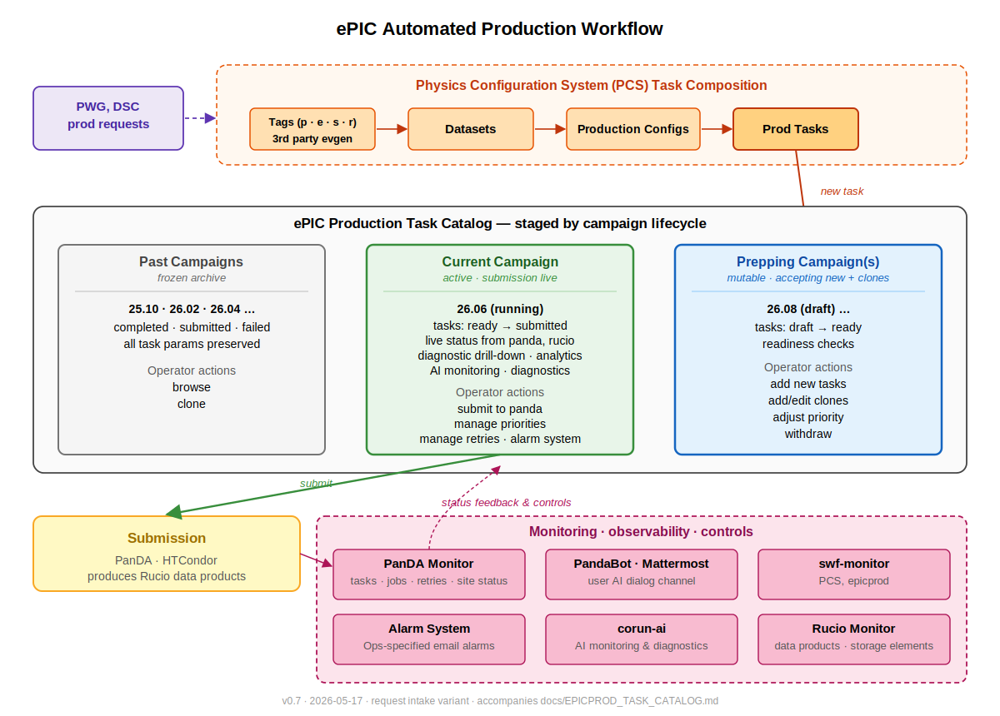

# ePIC Production Task Catalog

The ePIC Production Task Catalog is the PCS-backed catalog of production
tasks for epicprod. It replaces the static GitHub/Jekyll dataset page with
a campaign-aware view of production tasks. Campaigns are shown as tabs or
tab-like sections ordered left to right in time: past campaigns, the
current campaign, and the next campaign being prepared. The current and
future campaign views are dynamic interfaces for campaign task management.

The present static catalog is
`eic/epic-prod/docs/_documentation/default_datasets.md`
(rendered at https://eic.github.io/epic-prod/documentation/default_datasets).

Complementing the catalog is a production request path, where PWGs and DSCs
submit requests that the production team turns into tasks. The catalog links
back to originating requests, and request records link forward to derived
tasks. Initial request fields are based on the current
[production request spreadsheet](https://docs.google.com/spreadsheets/d/1BJeq3AYwefNC9m3palH6T0SHMxmRmHpOzLTSa_6SZIU/edit?gid=0#gid=0).

The following diagram shows the automated production workflow and the
catalog's place in it.

## Relationship to Other Documents

This document implements the Dynamic Public Catalog described in
`PCS_DATASET_REQUEST_WORKFLOW.md`.

For submission, operators filter, review, select, and submit tasks from the
catalog. Submission details are covered by `JEDI_INTEGRATION.md`.
Inspection, cloning, and editing use the task workbench reached from the
catalog.

## Scope

- Full-page catalog views for campaigns with task inventory, filtering, sorting,
  and bulk selection.
- Task Composition views as the workbench for inspection, cloning, and editing.
- Catalog fields: PWG, priority, Use flags, submission path, input source,
  and BG-mixing state.
- Third-party EVGEN input tracking and Rucio sourcing.
- Backfill and sync from the CSV manifest source used by production.
- Operator actions, auth, audit, and publication checks.
- Production request interface modeled on the current request spreadsheet.

## 2. Submission Paths

The catalog supports multiple submission paths. PCS composes tasks; the
catalog stages them by campaign lifecycle; the selected submission path
handles dispatch when the operator presses Submit on the Current Campaign
view.

Submission paths in use and planned:

| Submission path | How invoked |
|---|---|
| HTCondor batch submission via `submit_csv.sh` | CSV manifest → env-prefix shell command → `condor_submit`. Source: `job_submission_condor/scripts/submit_csv.sh`. |
| PanDA workload management | Per `JEDI_INTEGRATION.md`: CSV manifest → `taskParamMap` → PanDA task submission. |
| PanDA-orchestrated multi-stage workflows | `internal_evgen` workflow mode in `ProdConfig`, per `PCS_DATASET_REQUEST_WORKFLOW.md`. |

Catalog entries need a submission path and the parameters required by that
path. `ProdConfig` already carries the relevant workflow mode plus the
env-var or taskParam set used by current submission code.

## 3. Current Production Practice

The prod team's working submission notebook
([dataset Colab](https://colab.research.google.com/drive/197q6hE1tZ0ghewcpK06vc3O7qcPf8nTz?usp=sharing);
[repo snapshot](datasets-colab-snapshot-20260517.ipynb))
has operator-set fields with maps to PCS: detector version
and config, container tag, output controls, Rucio registration, x509 auth,
input CSV path, and signal/background settings for BG-mixing.

The catalog supports batch operations on groups of related tasks, such as
all beam energies for a process or all Q² bins for a DIS configuration.
Bulk actions include submit, archive, clone, and withdraw on the filtered
task list.

Background-mixing campaigns combine signal CSVs with sets of background
configurations. The catalog
supports parameterized expansion of a signal task into a matrix of
BG-variant tasks, each variant an individual catalog entry.

CSV manifest paths encode physics parameters (beam energies, Q² ranges,
generator versions). Catalog intake parses these on import.

## 4. Third-Party Inputs

PWGs and DSCs may request production from EVGEN samples produced outside the
standard campaign dataset pipeline. The request record preserves the
declared source, such as a JLab path, URL, file list, or collaboration
storage location, in `simu_path` and related source metadata.

Current handling records the declared source and production-team status
fields in the request record. Task creation requires an input source usable
by the submission path, so third-party EVGEN inputs must be available from
Rucio before derived tasks use them.

The schema represents both source layers: `simu_path` preserves the
declared external source, and `rucio_source` records the Rucio DID or
container once the input is registered.

The workflow for registering third-party EVGEN samples in Rucio is still to
be defined. The catalog records the result once a Rucio source is available.

## 5. Production Request Records

PWG and DSC production requests are upstream records that precede Dataset
or ProdTask records. A requester describes the desired sample, the
production team checks input availability and validation status, and one or
more catalog tasks can later link back to the originating request.

The `prod_requests` table starts from the request spreadsheet fields:

| Field | Meaning |
|---|---|
| `requestor` | PWG or DSC making the request. |
| `simu_path` | Declared simulation or EVGEN input location. |
| `gen_config` | Generator configuration text from the request. |
| `nevents` | Requested event count. |
| `background` | Requested background condition, if specified. |
| `new_request` | Whether the row is marked as a new request. |
| `pre_tdr_use` | Pre-TDR use flag or value. |
| `early_science_use` | Early-science use flag or value. |
| `other_use` | Other use flag or value. |
| `description` | Free-text request description. |
| `priority` | Requester or production-priority value. |

System fields needed for operation:

| Field | Meaning |
|---|---|
| `status` | Request state, e.g. new, review, blocked, ready, linked, closed. |
| `source_url` | Source spreadsheet or form URL. |
| `source_row` | Source row identifier for idempotent import and traceability. |
| `created_by` | User or importer that created the record. |
| `created_at` | Creation timestamp. |
| `updated_at` | Last update timestamp. |

Production-team fields added during processing:

| Field | Meaning |
|---|---|
| `input_status` | Whether declared inputs are located, registered, and usable. |
| `rucio_source` | Rucio DID or container for the registered input source. |
| `validation_status` | Validation summary string. |
| `prod_task_links` | Relation to ProdTask records derived from the request. |

Production requests use a dedicated 2-panel page: a filterable request list
on the left, and request details, processing fields, and linked tasks on
the right. The request page feeds the task catalog but remains separate
from the campaign tabs for past, current, and next production tasks.

## 6. Full-Page Catalog View

The catalog is the primary page for browsing production tasks across
campaigns. It is organized as campaign tabs or tab-like sections, with time
flowing left to right: past campaigns, current campaign, and next campaign.
Tab/header color uses ergonomic pastels: grey for past campaigns, green for
the current campaign, and blue for future campaigns.

Past campaign sections are frozen archives of completed production tasks.
The current campaign contains active production tasks and the status needed
for follow-up: submission path, task status, output state, monitoring
badges, retry state, and links to PanDA Monitor, Rucio Monitor, and
swf-monitor detail pages. The current campaign has a top-level **clone to
new campaign** action for creating the next campaign from the current task
set.

The next campaign contains tasks being prepared for submission. Next-campaign
tasks are public, but not submittable until an ops user marks them ready.
Future campaign name and description fields are editable.

Each task row shows the fields needed for comparison and action: campaign,
requestor, physics tags, priority, Use flags, input source, submission path,
BG-mixing state, status, output dataset, and linked request when present.

Rows link to the task workbench for detailed inspection, editing, copying,
and review. The workbench is a 2-panel view: the left panel is a task list
for comparative inspection, selecting related tasks, and copying parameters
from existing tasks; the right panel is the focused task detail, with
editable fields, controls, validation and status, cloning/copying, and
submission-readiness actions.

The workbench left panel reuses the catalog task-list and filter component.
In the workbench it omits the campaign tabs, indicates the campaign of the
focused task, and uses a reduced column/control set appropriate for
comparative inspection and parameter copying.

The current workbench URL is:

    https://pandaserver02.sdcc.bnl.gov/swf-monitor/pcs/tasks/compose/?tab=tasks

Supported catalog actions include submit, clone, archive, withdraw,
priority update, readiness update, and BG-mixing matrix expansion. Actions
apply either to a single task or to the current selected set.

The Current Campaign view shows the production status needed for action,
with status panels, drill-down links, inline alarm badges, and external
dashboard links. Four feeds are relevant:

- **PanDA Monitor** — task and job state, retry counts, site status, alarm
  signals (the `nfinalfailed`/`computed_finalfailurerate` family in
  `monitor_app/panda/api.py`), plus the April 21 Production WG dashboard
  requirement: "Develop dashboard that display usage across all resources
  in PanDA over time: How are we doing in terms of utilizing our
  allocations?" ([meeting notes](https://docs.google.com/document/d/1JA8GIQae30Ru62kgDN2pzqK90XBbQKz4LffXYbWNgIY/edit?tab=t.0#heading=h.y3evqgz3sc98)).
  The Iris allocation dashboard shown in those notes is a useful model:
  tabs for CPU, GPU, Jobs, Storage, Roles, Groups, Details, and History;
  summary fields for allocation, charged hours, available hours, remaining
  percent, machine/raw hours used, average charge factor, request/award,
  threshold status, and premium usage; and a time-series view comparing
  charged usage, machine usage, and estimated charge rate.
- **Rucio Monitor** — output dataset replicas and RSE status for the
  campaign's scope.
- **swf-monitor** — PCS and campaign-level state owned by this app.
- **corun-ai** — AI-driven monitoring and diagnostics; callbacks already
  wired via `monitor_app/panda/corun_callback.py` to the PandaBot Mattermost
  channel.

Feed implementation remains in the source subsystems.

## 7. Filters and Selection

Catalog filters cover the fields used to find task sets: campaign stage,
campaign, requestor, physics tags, priority, Use flags, status, readiness,
submission path, input source, BG-mixing state, output state, and linked
request.

Filters are displayed in a shared layout that works in both the full-page
catalog and the workbench. In the full-page catalog, filters sit above the
campaign task list. In the 2-panel workbench, the same filters sit at the
top of the left panel above the task list.

The active tab, filters, sort order, selected rows, and focused task are
encoded in URL state so catalog views are bookmarkable and shareable. The
same filter model is exposed through the task list API and MCP tooling.

Selection supports bulk actions on the filtered task list. Selection state
is explicit: operators can select individual rows, all visible rows, or all
rows matching the current filter. Bulk actions show the selected count and
apply only after confirmation.

Draft means not yet submittable. Draft tasks remain visible in the catalog.
Ops users can mark a draft task ready when required fields, input source,
submission path, and validation status are complete.

## 8. Backfill & CSV Manifest Source of Truth

Current production submission is driven by CSV manifests, not by direct
selection of JLab EVGEN directories. The dataset Colab passes relative CSV
paths such as `EXCLUSIVE/DVCS/...csv`, `DIS/NC/...csv`, and `SIDIS/...csv`
to `scripts/submit_csv.sh`; `submit_csv.sh` resolves those paths from the
GitLab CI artifacts for the `EIC/campaigns/datasets` project, under:

    results/nightly/${DETECTOR_CONFIG:-epic_craterlake}/main/datasets/timings/

The relevant source points are:

- [`job_submission_condor/scripts/submit_csv.sh`](https://github.com/eic/job_submission_condor/blob/main/scripts/submit_csv.sh):
  `BASEURL=https://eicweb.phy.anl.gov/api/v4/projects/491/jobs/artifacts/${DATASET_TAG:-main}/raw/${RESULTS}/datasets/timings/`
- [`job_submission_condor/scripts/csv_to_chunks.sh`](https://github.com/eic/job_submission_condor/blob/main/scripts/csv_to_chunks.sh):
  fetches
  `${BASEURL}${FILE}?job=collect` unless a local file is supplied.
- [`EIC/campaigns/datasets`](https://eicweb.phy.anl.gov/EIC/campaigns/datasets)
  `config_data`: source for BG-mixing JSON files referenced by `BG_FILES`.

PCS catalogs the production CSV manifest source: `DATASET_TAG`, detector
config, relative manifest path, parsed physics parameters, manifest
availability, BG config references, and the corresponding Rucio DID when
EVGEN inputs are registered. The public Campaign Datasets page is planning
documentation rather than the operational input catalog.
