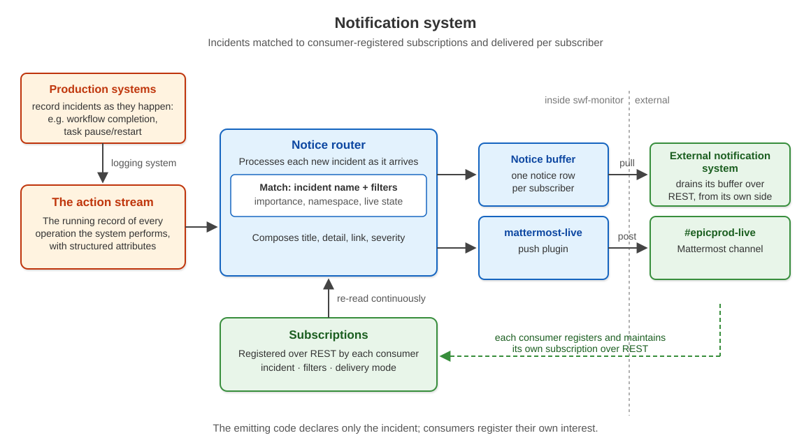

# Notice Routing

Notice routing extends the action stream ([ACTION_STREAM.md](ACTION_STREAM.md))
with subscriptions: named incidents matched to autonomously registered
subscribers and delivered per subscriber. The emitting code declares only the
incident; it never names a recipient. Consumers — external systems like personal
feed aggregators, and delivery plugins like the Mattermost publisher —
register their own interest and receive matching incidents through their chosen
delivery mode.

The design separates three concerns that today are partially fused:

- **Incidents** — what happened, recorded once, named.
- **Subscriptions** — who wants what, registered by the consumer.
- **Delivery** — how a matched incident reaches each subscriber.

## Incidents

The action stream is the incident source. The `action` identifier is the incident
name; the record's structured fields (`subject_type`, `subject_key`,
`subject_label`, `outcome`, `namespace`, free keys) are its attributes.
`subject_key` remains the canonical machine identity; `subject_label` may
provide its human-readable presentation. `ACTION_DEFAULTS` is the incident-name
catalog. Emission sites change nothing: recording an action is publishing an
incident.

Routing operates on the structured action space across logging namespaces
(`app_name`), independent of the `sublevel` and `live` axes — those govern
the built-in human channels (live page, `#epicprod-live`, digests), while
subscriptions are the extension mechanism for systems. A subscription may
filter on importance, but a low-importance mechanical incident is fully
subscribable.

## Subscriptions

A `NoticeSubscription` row: subscriber name, incident name (exact or trailing
wildcard; the API field is `event`), attribute filters (equality matches over the record's structured
fields; a list-valued filter means membership, so one subscription covers a
value set such as `{"operation": ["pause", "resume"]}`), delivery mode,
enabled flag, creator. Two reserved filter keys reach beyond the incident's
own attributes: `app_name` matches the record's logging namespace, and
`live` matches the incident's effective live state — the runtime live-policy
override where one exists, else the record's `live_default` — so the live
stream is selectable as a subscription. Token-authed CRUD at
`/api/notices/subscriptions/`, so a third-party system registers and
maintains its own subscriptions without swf code changes. Subscription
changes are themselves logged actions.

## Delivery

Two modes, chosen per subscription:

- **Buffered pull** — the router writes one notice row tagged with the
  subscriber name; the subscriber drains its buffer over REST from its own
  side. This generalizes the existing Capcom store (`CapcomNotice` gains the
  subscriber tag; the existing drain endpoint and retention behavior carry
  over), and preserves the external-consumer boundary: swf buffers locally
  and holds no credential into any external system.
- **Push plugin** — the router hands the incident to a named in-process plugin:
  the subscription's delivery value is the plugin name, resolved in the
  registry in `monitor_app/notice_plugins.py`. Push delivery is
  at-most-once — a delivery failure is logged and the pass continues, so a
  push outage never stalls buffered-pull delivery; the incident remains on the
  log record page. The `#epicprod-live` Mattermost publisher is the first
  plugin (`mattermost-live`); each plugin's settings live in SysConfig.

Notice composition from the incident is deterministic: title from the operation
when present, otherwise the action, plus `subject_label` when present, otherwise
`subject_key`; detail from `narration`/`reason`/`summary` where present, URL to
the log record, severity from the outcome, dedup key from the record id.
Composition belongs to the router, not to emitters or subscribers. Incidents
may carry `severity` (how bad — e.g. an assessment verdict) and `url`
(where to look — a subject page rather than the log record) as ordinary
attributes; the router honors them and absolutizes a path-form `url` onto
the external face.

The router is a stream tailer — the proven publisher pattern: a single
polling service that matches each new record against enabled subscriptions
and performs deliveries, with per-cycle caps and counted overflow, never
silent drops. Emission stays pure and never blocks or fails on delivery
problems.

## Workflow completion incidents

Workflow execution status changes arrive by plain REST update and record no
action today. The execution update path gains a terminal-transition incident:
when status reaches `completed` or `failed`, it logs
`workflow_execution_completed` (namespace, execution id, status, elapsed,
and a `notice` attribute carried from the execution's parameters).
`testbed run --notice` (equivalently a `testbed.toml` key) stamps the run.

The first use is the nightly testbed heartbeat: the overnight cron run
carries the stamp, and a subscription (subscriber `capcom`, incident
`workflow_execution_completed`, filter `notice=true`) delivers exactly one
notice per overnight run into the operator's feed — one notice for each
day the testbed ran, with warning severity on failure.

## Migration

The direct Capcom posters (ops-agent pause/resume terminal notices, the
assessment and delivery-daily notices) emit matching stream incidents carrying
the needed fields; each is a subscription and its bespoke posting code is
retired. The subscriptions replacing them: `panda_task_operation` with
`operation` in pause/resume (single and bulk, terminal outcomes only —
the incidents carry the human count line as `summary` and the task page as
`url`); `assessment_register` filtered to the scheduled kinds (narration,
verdict severity, report url); `assessment_enforce` filtered to error
outcomes (salvage and quarantine, floor-verdict severity); and
`delivery_daily_rebuild` (newest-day arrivals as `summary`, the campaign
view as `url`). The `/api/capcom/notices/ingest/` endpoint remains for
genuinely external posters. The Mattermost publisher's incident selection
(live + importance threshold) is the `epicprod-live` subscription — incident
`*`, filters `{"app_name": "epicprod", "live": true, "sublevel": ["high",
"normal"]}`, delivery `mattermost-live`; its formatting is unchanged. The
importance threshold is the subscription's `sublevel` list, edited over
REST; the `epicprod_live_min_sublevel` SysConfig knob is retired. The
channel name (`epicprod_live_channel`) and poll cadence
(`epicprod_live_poll_seconds`) remain SysConfig knobs.

## Delivery sequence

1. The router service, the subscription model and REST, buffered-pull
   delivery on the generalized store, and the workflow-completion incident —
   the nightly heartbeat working end to end.
2. Migration of the direct Capcom posters to subscriptions.
3. The Mattermost publisher as a push plugin.

## Status

Step 1 is deployed (2026-08-11) and verified end to end: the router runs
in the publisher cycle (`monitor_app/notice_router.py`), subscriptions
serve at `/api/notices/subscriptions/`, and the first subscription —
`capcom ← workflow_execution_completed`, filter `notice=true` — delivers
the nightly testbed heartbeat from the stamped `testbed run --notice`
cron run. Step 2 (2026-08-12) migrated the direct Capcom posters to the
four subscriptions listed under Migration and retired their posting code.
Step 3 (2026-08-12) moved the Mattermost publication into the
`mattermost-live` push plugin, selected by the `epicprod-live`
subscription; the `publish_epicprod_live` command is now only the tailer
loop around the routing pass.
